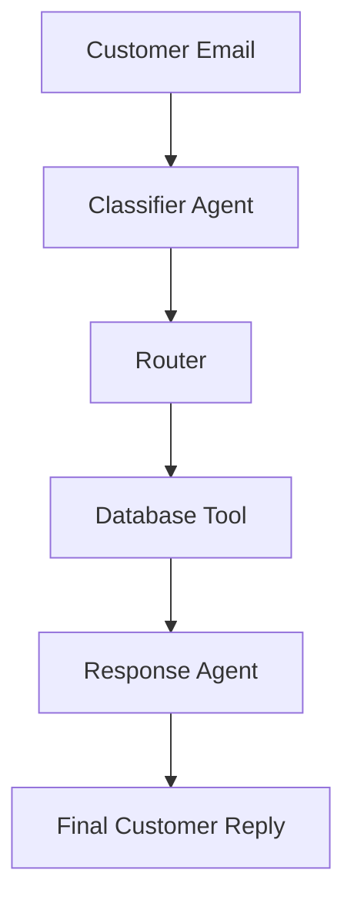
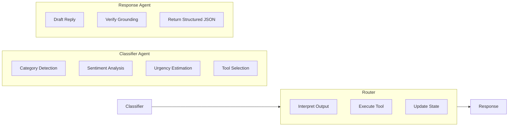

# Multi-Agent Customer Ticket Router & Resolution System


An intelligent, modular customer support automation project that analyzes incoming tickets, classifies intent, detects sentiment and urgency, performs verified database lookups through tool calling, and drafts professional customer responses.

This project showcases practical use of LLMs, multi-agent orchestration, structured outputs, and tool-enabled reasoning to streamline customer support workflows in a controlled and extensible architecture.

---

## Table of Contents

- [Project Objective](#project-objective)
- [Key Features](#key-features)
- [Problem Statement](#problem-statement)
- [System Overview](#system-overview)
- [Workflow Explanation](#workflow-explanation)
- [Multi-Agent Architecture](#multi-agent-architecture)
- [Why This Architecture Works](#why-this-architecture-works)
- [Tool Calling Design](#tool-calling-design)
- [Structured Outputs with Pydantic](#structured-outputs-with-pydantic)
- [Mock Database](#mock-database)
- [Project Structure](#project-structure)
- [Installation](#installation)
- [Environment Variables](#environment-variables)
- [Running the Project](#running-the-project)
- [Example Use Cases](#example-use-cases)
- [Future Enhancements](#future-enhancements)
- [Team Responsibilities](#team-responsibilities)
- [Learning Outcomes](#learning-outcomes)
- [Strengths of the Project](#strengths-of-the-project)
- [Suggested Improvements for Portfolio or Submission](#suggested-improvements-for-portfolio-or-submission)
- [License](#license)

---

## Project Objective

Customer support teams frequently receive large volumes of unstructured tickets through email or forms. Manually reading, categorizing, validating, and replying to each request increases turnaround time, creates backlogs, and makes response quality inconsistent.

This project addresses that problem by building an AI-powered multi-agent pipeline that can:

- Classify customer tickets into predefined support categories.
- Detect customer sentiment from the message tone.
- Estimate urgency based on issue severity and wording.
- Decide whether external or internal data lookup is required.
- Dynamically select the correct database tool.
- Fetch customer and order details from a mock database.
- Generate professional, context-aware customer responses using only verified information.

---

## Key Features

- AI-powered ticket classification
- Sentiment analysis
- Urgency detection
- Dynamic tool selection
- Mock database integration
- Professional response generation
- Structured LLM outputs with Pydantic
- Modular multi-agent architecture
- OpenAI and OpenRouter support
- Extendable design for LangGraph integration
- Clean separation of agents, tools, graph logic, and state management
- Test-ready structure for iterative development

---

## Problem Statement

Traditional customer support pipelines often suffer from:

- Slow first-response time
- Manual triaging overhead
- Inconsistent categorization of tickets
- Delays in retrieving customer or order information
- Risk of hallucinated or inaccurate AI-generated responses

The proposed system reduces these issues by creating a workflow where each agent has a clearly defined responsibility and uses validated data before generating responses.

---

## System Overview

The system follows a multi-stage processing pipeline:



Each stage has a distinct role, making the overall system easier to test, debug, and extend.

---

## Workflow Explanation

### 1. Customer Ticket Intake
The pipeline begins when a customer submits a support email or ticket. The input is generally unstructured natural language and may contain complaints, refund requests, order queries, or technical issues.

### 2. Classifier Agent
The classifier agent reads the ticket and produces structured outputs. Its responsibilities include:

- Identifying the ticket category, such as refund, order issue, account issue, delivery problem, or general inquiry.
- Detecting the customer sentiment, such as positive, neutral, frustrated, or angry.
- Estimating urgency, for example low, medium, or high.
- Deciding whether a database lookup is required.
- Selecting the most relevant tool for the next stage.

### 3. Router
The router acts as the orchestration layer. Based on the classifier agent's output, it:

- Selects the appropriate database tool
- Executes the required lookup function
- Retrieves customer profile or order details
- Updates the shared state object
- Passes verified data to the response agent

### 4. Database Tool Layer
The tool layer connects the AI system with structured backend data. In this project, mock tools simulate database access for local testing and development.

Currently supported tools:

- `fetch_user_profile()`
- `fetch_user_orders()`

This approach demonstrates how LLM agents can safely interact with external tools instead of inventing facts.

### 5. Response Agent
The response agent generates the final customer-facing reply. It uses:

- Original ticket content
- Classifier output
- Verified data returned from tools
- Prompt constraints to ensure professionalism and factual accuracy

The response is designed to be polite, concise, and aligned with support communication standards.

---

## Multi-Agent Architecture



### Classifier Agent
**Responsibilities:**

- Read incoming customer emails
- Detect ticket category
- Detect sentiment
- Detect urgency
- Decide whether a database lookup is necessary
- Select the appropriate tool for downstream execution

### Router
**Responsibilities:**

- Interpret classifier outputs
- Execute selected tools dynamically
- Fetch customer profile details
- Fetch order information when needed
- Update and pass shared pipeline state

### Response Agent
**Responsibilities:**

- Generate professional customer replies
- Use only verified information from tools and state
- Avoid hallucinated details
- Return structured JSON output for downstream usage

---

## Why This Architecture Works

| Principle | Benefit |
|---|---|
| Separation of concerns | Each agent handles a single logical task |
| Better reliability | Verified tool output is used before drafting replies |
| Scalability | New tools or agents can be added without rewriting the whole pipeline |
| Testability | Each component can be unit tested independently |
| Maintainability | Prompts, models, tools, and routing logic remain organized |

---

## Tool Calling Design

Tool calling is central to the project. Rather than letting the language model answer only from prompt context, the system allows the classifier to determine when factual retrieval is necessary.

### Current Tools

| Tool | Purpose |
|------|---------|
| `fetch_user_profile()` | Retrieves customer profile information |
| `fetch_user_orders()` | Retrieves customer order history or order-specific details |

### Benefits of Tool Calling

- Reduces hallucination risk
- Grounds replies in structured data
- Makes the workflow closer to real production systems
- Demonstrates agent-to-tool interoperability
- Supports future integration with SQL, REST APIs, or vector databases

---

## Structured Outputs with Pydantic

Pydantic is used to enforce structured outputs from LLM responses. This is important because downstream routing depends on predictable fields.

```python
class TicketAnalysis(BaseModel):
    category: str
    sentiment: str
    urgency: str
    needs_lookup: bool
    selected_tool: Optional[str]
    response_message: str
```

### Advantages

- Output validation
- Safer pipeline execution
- Easier debugging
- Improved developer confidence
- Better compatibility with API-based applications

---

## Mock Database

The project uses a mock database to simulate real customer support data without external dependencies.

### Included Data Domains

- Users
- Orders
- Tickets

### Why a Mock Database?

- Enables full pipeline testing locally
- Simplifies development and debugging
- Avoids dependency on production systems
- Makes the project ideal for demos, hackathons, and academic submissions

---

## Project Structure

```text
AI-Customer-Support/
│
├── agents/
│   ├── __init__.py
│   ├── classifier_agent.py
│   ├── response_agent.py
│   ├── llm.py
│   ├── models.py
│   └── prompts.py
│
├── data/
│   ├── __init__.py
│   └── mock_db.py
│
├── graph/
│   ├── __init__.py
│   └── router.py
│
├── tools/
│   ├── __init__.py
│   └── db_tools.py
│
├── utils/
│   ├── __init__.py
│   └── logger.py
│
├── tests/
│   ├── test_classifier.py
│   ├── test_llm.py
│   ├── test_llm_response.py
│   └── test_response.py
│
├── run_pipeline.py
├── state.py
├── requirements.txt
├── README.md
├── .env.example
└── .gitignore
```

### Module Breakdown

**`agents/`** — Contains all LLM-driven logic, including classification, response generation, model configuration, output schemas, and prompts.

**`data/`** — Stores mock structured data used to simulate customer records, order history, and ticket context.

**`graph/`** — Defines routing and orchestration logic. This is the best place for future LangGraph-based execution flow.

**`tools/`** — Implements callable database functions that the router invokes based on classifier decisions.

**`utils/`** — Provides shared utilities such as logging and helper functions.

**`tests/`** — Includes unit tests to validate classifier outputs, LLM behavior, and response generation quality.

---

## Technologies Used

- Python 3.11+
- OpenAI Python SDK
- OpenRouter API
- Pydantic
- Python Dotenv
- HTTPX
- Mock Database
- Multi-Agent Architecture

---

## Installation

### 1. Clone the Repository

```bash
git clone https://github.com/<your-username>/AI-Customer-Support.git
cd AI-Customer-Support
```

### 2. Create a Virtual Environment

```bash
python -m venv .venv
```

### 3. Activate the Virtual Environment

**Windows**

```bash
.venv\Scripts\activate
```

**Linux / macOS**

```bash
source .venv/bin/activate
```

### 4. Install Dependencies

```bash
pip install -r requirements.txt
```

---

## Environment Variables

Create a `.env` file using `.env.example`.

### Example

```env
LLM_PROVIDER=openrouter
MODEL_NAME=openai/gpt-oss-20b:free
OPENROUTER_API_KEY=your_api_key_here

# Optional
OPENAI_API_KEY=your_openai_api_key_here
```

---

## Running the Project

Execute the complete pipeline:

```bash
python run_pipeline.py
```

### Example Pipeline Stages


---

## Example Use Cases

This project can be adapted for:

- E-commerce support automation
- SaaS support ticket routing
- Refund and return management systems
- Order tracking assistants
- Internal IT helpdesk ticket triage
- Research demos on tool-augmented LLM systems

---

## Future Enhancements

- LangGraph integration
- Additional database tools
- Knowledge base retrieval
- Vector database integration
- Human-in-the-loop approval workflows
- Web dashboard for ticket monitoring
- REST API exposure
- Ticket priority queue
- Analytics dashboard
- Multi-language support
- Real database connectivity
- CRM integration

---

## Team Responsibilities

| Team Member | Responsibilities |
|------------|------------------|
| Ram Charan | Mock database, database tools, tool calling functions |
| Sayee Gosavi | LLM integration, prompt engineering, classifier agent, response agent, structured outputs |
| Ayush | LangGraph workflow, agent orchestration, pipeline routing, end-to-end execution |

---

## Learning Outcomes

This project provides hands-on exposure to:

- Multi-agent AI systems
- Prompt engineering
- Tool calling patterns
- Structured LLM outputs
- Pydantic validation
- AI workflow orchestration
- Modular software architecture
- Practical support automation design

---

## Strengths of the Project

- Clear real-world use case
- Strong modular architecture
- Good academic and portfolio value
- Demonstrates both AI reasoning and backend workflow design
- Easy to demo because of mock data
- Extendable toward production-grade systems

---

## Suggested Improvements for Portfolio or Submission

To make the project even stronger for GitHub, hackathons, or academic presentation, consider adding:

### 1. Architecture Diagram
Add a visual system diagram showing the interaction between the classifier, router, tools, database, and response agent.

### 2. Sample Tickets and Outputs
Include 3 to 5 example tickets with:

- Input email
- Classified category
- Sentiment
- Urgency
- Tool selected
- Final generated response

### 3. Evaluation Metrics
Track system behavior using metrics such as:

- Classification accuracy
- Response consistency
- Hallucination rate
- Tool selection accuracy
- Average processing time

### 4. API or UI Layer
Expose the system through:

- A simple Streamlit interface
- FastAPI endpoints
- A lightweight web dashboard

### 5. Logging and Observability
Add structured logs for:

- Agent decisions
- Tool calls
- Validation failures
- Final responses

---

## License

This project is developed for educational and learning purposes.

---

**One-Line Summary:** A modular AI-powered customer support pipeline that classifies tickets, performs verified tool-based lookups, and generates professional responses through a multi-agent LLM workflow.